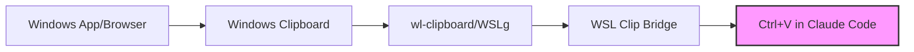

# 🌉 WSL Clip Bridge

<div align="center">

[](https://github.com/camjac251/wsl-clip-bridge/actions/workflows/ci.yml)
[](LICENSE)
[](https://www.rust-lang.org)
[](https://docs.microsoft.com/en-us/windows/wsl/)
[](https://claude.ai/code)

**Seamless clipboard sharing between Windows and WSL without X11**

Built specifically for **[Claude Code](https://claude.ai/code)** screenshot pasting in WSL

[Features](#features) • [Quick Start](#-quick-start) • [Usage](#usage) • [Configuration](#configuration)

</div>

## Why?

Ever wanted to paste a Windows screenshot directly into [**Claude Code**](https://claude.ai/code) running in WSL? This tool makes it effortless - copy from any Windows application and paste directly in WSL. The tool automatically detects Windows clipboard via WSLg's wl-clipboard integration, no complex setup required.

Perfect for:

- 🤖 **[Claude Code](https://claude.ai/code)** → Paste screenshots directly in terminal
- 🌐 **Browser Images** → Copy from Chrome/Edge and paste in WSL
- 📸 **ShareX** → Advanced screenshot workflows
- 🖼️ Any Windows → Linux clipboard needs

## Features

<table>
<tr>
<td>

**🔒 Secure**

- Optional path restrictions
- Size limits
- TTL auto-cleanup

</td>
<td>

**⚡ Fast**

- No X11/Wayland needed
- Auto-detects Windows clipboard
- BMP→PNG conversion built-in
- File-based fallback

</td>
<td>

**🎯 Compatible**

- Drop-in xclip replacement
- Same CLI arguments
- Multi-arch (x64/ARM64)
- WSLg wl-clipboard support

</td>
</tr>
</table>

## 🚀 Quick Start

```powershell
# One-line install (Windows PowerShell)
iwr -useb https://raw.githubusercontent.com/camjac251/wsl-clip-bridge/main/scripts/setup.ps1 | iex
```

> [!TIP]
> The installer auto-detects your WSL distro, architecture, and sets up wl-clipboard integration for direct Windows clipboard access.

<details>
<summary><b>Manual Installation Options</b></summary>

### Download Pre-built Binary (WSL)

```bash
ARCH=$(uname -m | sed 's/x86_64/amd64/;s/aarch64/arm64/')
wget https://github.com/camjac251/wsl-clip-bridge/releases/latest/download/xclip-${ARCH}
chmod +x xclip-${ARCH}
sudo mv xclip-${ARCH} /usr/local/bin/xclip
```

### Build from Source (WSL)

```bash
git clone https://github.com/camjac251/wsl-clip-bridge
cd wsl-clip-bridge

# Build statically linked musl binary (works on any Linux, no GLIBC dependency)
rustup target add x86_64-unknown-linux-musl  # or aarch64-unknown-linux-musl for ARM64
cargo build --release --target x86_64-unknown-linux-musl --locked
sudo install -m 755 target/x86_64-unknown-linux-musl/release/xclip /usr/local/bin/
```

> [!NOTE]
> Binaries are statically linked using musl libc for maximum compatibility across Linux systems.

</details>

## Usage

### Claude Code Workflow

**Option 1: Direct Windows Clipboard**
1. **Copy image** in Chrome, Paint, ShareX, etc. (Right-click → Copy Image)
2. **In Claude Code terminal**: Press `Ctrl+V` to paste directly

**Option 2: ShareX Integration**
1. **Take screenshot** with ShareX
2. **In Claude Code terminal**: Press `Ctrl+V` to paste directly

That's it! No commands needed for the primary use case.

> [!IMPORTANT]
> **Terminal Configuration Required**: Your terminal must forward `Ctrl+V` to the application, not intercept it for paste.
>
> - **Windows Terminal**: Settings → Actions → Remove/unbind `Ctrl+V` shortcut
> - **Warp**: Settings → Keyboard Shortcuts → Set "Paste" to `Ctrl+Shift+V`, Clear "Alternate Terminal Paste" (`Ctrl+V`)
> - **Other terminals**: Look for paste shortcuts and ensure `Ctrl+V` is not bound
>
> Without this, `Ctrl+V` won't reach Claude Code and pasting won't work.

### Manual Commands

| Action            | Command                                |
| ----------------- | -------------------------------------- |
| **Copy text**     | `echo "Hello" \| xclip -i`             |
| **Paste text**    | `xclip -o`                             |
| **Copy image**    | `xclip -t image/png -i screenshot.png` |
| **Check formats** | `xclip -t TARGETS -o`                  |

### How It Works

When WSLg is detected, the tool automatically uses wl-clipboard for seamless Windows integration:
- **Automatic BMP→PNG conversion**: Windows clipboard BMPs are converted to PNG for efficiency (15-20x size reduction)
- **Smart priority**: Checks Windows clipboard first (always latest), falls back to cached files
- **Zero configuration**: Works out of the box with WSLg

### ShareX Integration (Optional)

> [!NOTE]
> ShareX provides advanced screenshot features like annotations and uploads. The tool works with or without ShareX - the installer configures it automatically if detected.

<details>
<summary><b>Manual ShareX Setup</b></summary>

#### Step 1: Create the Batch File

Create `%USERPROFILE%\Documents\ShareX\Tools\copy-to-wsl-clipboard.bat`:

```batch
@echo off
rem WSL Clip Bridge - ShareX Integration
rem Replace "Ubuntu" with your WSL distro name (run 'wsl -l' to see available distros)

if "%~1"=="" (
    echo Error: No file path provided
    exit /b 1
)

rem Get file extension to determine MIME type
set "EXT=%~x1"
set "EXT=%EXT:~1%"

rem Set MIME type based on extension
if /i "%EXT%"=="png" (
    set "MIME=image/png"
) else if /i "%EXT%"=="jpg" (
    set "MIME=image/jpeg"
) else if /i "%EXT%"=="jpeg" (
    set "MIME=image/jpeg"
) else if /i "%EXT%"=="gif" (
    set "MIME=image/gif"
) else if /i "%EXT%"=="webp" (
    set "MIME=image/webp"
) else (
    rem Default to PNG if unknown
    set "MIME=image/png"
)

rem Convert Windows path to WSL path and copy to clipboard
for /f "usebackq tokens=*" %%i in (`wsl -d Ubuntu wslpath -u "%~1"`) do set WSLPATH=%%i
wsl -d Ubuntu xclip -selection clipboard -t %MIME% -i "%WSLPATH%"

if %ERRORLEVEL% NEQ 0 (
    echo Error: Failed to copy image to WSL clipboard
    exit /b %ERRORLEVEL%
)
```

**Important**: Replace `Ubuntu` with your WSL distribution name. Check with: `wsl -l`

#### Step 2: Configure ShareX

1. **ShareX** → **Task Settings** → **Actions** → **Add**:
   - Name: `Copy to WSL Clipboard`
   - File path: `%USERPROFILE%\Documents\ShareX\Tools\copy-to-wsl-clipboard.bat`
   - Arguments: `%input`
   - Hidden window: ✅ (recommended)

2. **After capture tasks** → **Add**:
   - ✅ Save image to file
   - ✅ Perform actions → Select "Copy to WSL Clipboard"

3. **Hotkey settings** (optional):
   - Set up `Ctrl+Shift+S` or your preferred shortcut
   - Action: Capture region

#### Step 3: Test It

1. Take a screenshot with ShareX
2. Open WSL terminal
3. Run: `xclip -t TARGETS -o` (should show `image/png`)
4. In Claude Code: Press `Ctrl+V` to paste

</details>

### Workflow Example



## Configuration

> [!IMPORTANT]
> Config auto-creates at `~/.config/wsl-clip-bridge/config.toml` on first run.

```toml
# Clipboard data TTL in seconds
ttl_secs = 300

# Maximum image dimension for automatic downscaling
# Set to 1568 for optimal Claude API performance
# Set to 0 to disable downscaling
max_image_dimension = 1568

# Maximum file size in MB
max_file_size_mb = 100

# Clipboard integration mode
# "auto" = Check wl-clipboard first, fall back to files (default)
# "file_only" = Only use file-based clipboard (ShareX mode)
clipboard_mode = "auto"

# Cache images from wl-clipboard for faster subsequent access
cache_wl_images = true

# Security: Directory access restrictions (optional)
# If not configured, all paths are allowed
# allowed_directories = [
#   "/mnt/c/Users/YOUR_USERNAME/Documents/ShareX",
#   "/home/YOUR_USERNAME",
#   "/tmp"
# ]
```

<details>
<summary><b>Advanced Options</b></summary>

### Environment Variables

- `WSL_CLIP_BRIDGE_TTL_SECS` - Override TTL
- `WSL_CLIP_BRIDGE_CONFIG` - Custom config path

### Clipboard Modes Explained

| Mode | Description | Use Case |
|------|-------------|----------|
| `auto` (default) | Checks wl-clipboard first, falls back to files | General use, works with any Windows app |
| `file_only` | Only uses file-based clipboard | ShareX-only workflows, or if wl-clipboard has issues |

### Directory Access Control

If not configured, all paths are allowed.
To restrict access to specific directories (and their subdirectories):

```toml
allowed_directories = [
  "/mnt/c/Users/YOU/Documents/ShareX",
  "/home/YOU",
  "/tmp"
]
```

### Image Optimization

- Auto-downscales to `max_image_dimension`
- Preserves aspect ratio
- Uses Lanczos3 (best for screenshots with text)
- BMP images from Windows are automatically converted to PNG

</details>

## Troubleshooting

<details>
<summary><b>Common Issues</b></summary>

### `xclip: command not found`

```bash
which xclip  # Should show /usr/local/bin/xclip
echo $PATH   # Ensure includes install directory
```

### Images from Windows apps not pasting

1. **Check WSLg/wl-clipboard**: Run `wl-paste --list-types` after copying
   - Should show `image/bmp` or `image/png`
2. **Verify clipboard mode**: Check `~/.config/wsl-clip-bridge/config.toml`
   - Ensure `clipboard_mode = "auto"` (not `"file_only"`)
3. **Test conversion**: Copy image in Windows, then run:
   ```bash
   xclip -t TARGETS -o  # Should show image/png
   xclip -o -t image/png > test.png  # Should save the image
   ```

### Permission Denied

- If `allowed_directories` is configured, file must be in those paths
- Check config: `cat ~/.config/wsl-clip-bridge/config.toml`

### Ctrl+V Not Working in Claude Code

1. **Terminal is intercepting Ctrl+V**: Your terminal must forward the key to the app
   - Windows Terminal: Settings → Actions → Remove `Ctrl+V` binding
   - Warp: Settings → Keyboard Shortcuts → Set "Paste" to `Ctrl+Shift+V`, Clear "Alternate Terminal Paste"
2. Test with: `xclip -t TARGETS -o` (should show `image/png` after copying an image)

### BMP files showing as 0 bytes

This is normal - the tool converts BMP to PNG automatically. Use `xclip -o -t image/png` to get the converted image.

### WSLg not available

If you're on Windows 10 or WSLg isn't available:
- The tool will still work with ShareX integration
- Set `clipboard_mode = "file_only"` in config to disable wl-clipboard checks

</details>

## Architecture

<details>
<summary><b>How It Works</b></summary>

1. **Dual-mode operation**:
   - **wl-clipboard mode**: Direct access to Windows clipboard via WSLg
   - **File mode**: ShareX or manual file operations
2. **Smart format conversion**: BMP→PNG automatic conversion
3. **Secure**: Rust with `#![forbid(unsafe_code)]`
4. **Efficient**: TTL-based cleanup, automatic downscaling
5. **Compatible**: Full xclip CLI compatibility

```
~/.cache/wsl-clip-bridge/
├── text.txt        # Text clipboard (fallback)
├── image.bin       # Image data (cache)
└── image.format    # MIME type

Windows Clipboard → wl-clipboard (WSLg) → WSL Clip Bridge → Linux Apps
```

### Priority System

1. For output (`xclip -o`):
   - Check wl-clipboard first (always has latest Windows clipboard)
   - Convert BMP→PNG if needed
   - Fall back to cached files if wl-clipboard unavailable

2. For input (`xclip -i`):
   - Always write to file cache (maintains ShareX compatibility)

</details>

## Development

<details>
<summary><b>Building & Contributing</b></summary>

```bash
# Dev build
cargo build

# Run tests
cargo test

# Format & lint
cargo fmt
cargo clippy --all-targets --all-features -- -D warnings
```

**Tech Stack:**

- Rust 1.89+ (Edition 2024)
- No unsafe code
- GitHub Actions CI/CD
- Multi-arch releases (x64/ARM64)
- wl-clipboard integration for WSLg

</details>

---

<div align="center">

**Built with 🦀 Rust** • **Made for [Claude Code](https://claude.ai/code)** • **[Report Issues](https://github.com/camjac251/wsl-clip-bridge/issues)**

</div>